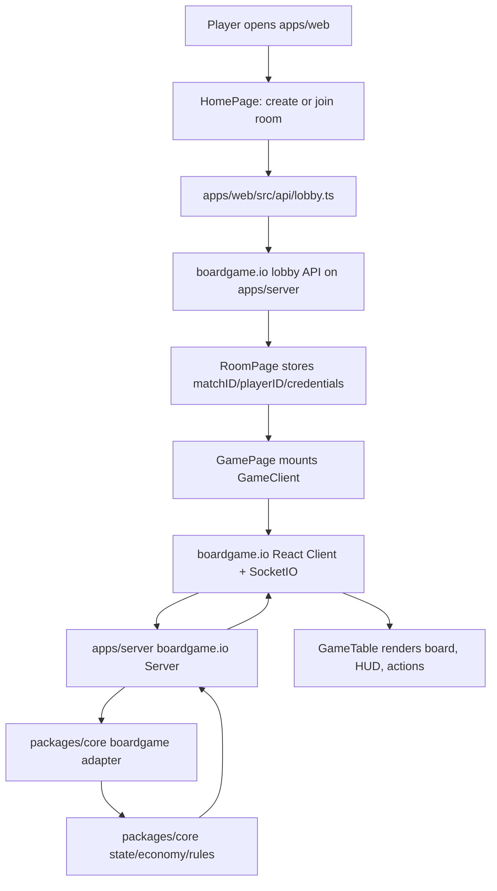

# System Architecture

## Overview

Moronarchy is a pnpm TypeScript monorepo with three main runtime areas:

- `apps/web`: React mobile webapp.
- `apps/server`: boardgame.io multiplayer server.
- `packages/core`: shared pure TypeScript game rules.

The core rule is simple: game logic belongs in `packages/core`; web renders state; server validates and synchronizes moves.

## Runtime Flow



## Folder Responsibilities

| Path | Responsibility | Should Not Contain |
| --- | --- | --- |
| `packages/core` | Dice, movement, land, rent, upgrades, victory, shared types | React, DOM, CSS, browser APIs, server-only APIs |
| `apps/server` | boardgame.io server, lobby security, CORS, runtime process | UI rendering, CSS, duplicated rule math |
| `apps/web` | React screens, board rendering, HUD, modals, lobby client | Authoritative game decisions |
| `tests/e2e` | Browser-level multiplayer smoke tests | Core rule unit tests |
| `docs` | Rules, stack, architecture, maintenance notes | Generated build output |

## Data And Move Flow

1. Player clicks an action in React UI.
2. `GameTable` calls a boardgame.io move such as `rollDice`, `buyLand`, `upgradeLand`, or `skipTileAction`.
3. The move is sent to `apps/server` through boardgame.io multiplayer transport.
4. Server runs the shared move adapter from `packages/core/src/boardgame-adapter.ts`.
5. Adapter calls pure core functions in `packages/core/src/state.ts`.
6. Core mutates `MoronarchyState` according to the rules.
7. boardgame.io syncs the new state back to connected clients.
8. React components rerender from `G`, the synchronized game state.

## State Ownership

`MoronarchyState` is the authoritative game state shape. It is defined in `packages/core/src/types.ts`.

Important state fields:

- `players`: king status, coin, health, level, position, defeated flag.
- `tiles`: tile ownership and land level.
- `currentRound` and `maxRounds`: round-limit tracking.
- `phase`: current interaction phase.
- `winnerId`: final winner when the game ends.
- `lastDiceRoll`: display data for dice and movement feedback.
- `logs`: short gameplay messages for UI.

The browser may display and predict legal UI actions, but the server remains authoritative.

## Key Modules

| Module | Purpose |
| --- | --- |
| `packages/core/src/constants.ts` | Board size, starting stats, economy constants |
| `packages/core/src/economy.ts` | Land segment, rent, upgrade-cost helpers |
| `packages/core/src/state.ts` | Pure game state transitions |
| `packages/core/src/boardgame-adapter.ts` | boardgame.io move adapter and turn advancement |
| `apps/server/src/game.ts` | Server game config export |
| `apps/server/src/security.ts` | Lobby request guard and metadata sanitization |
| `apps/web/src/api/lobby.ts` | Client lobby create/join/session helpers |
| `apps/web/src/game/GameClient.tsx` | boardgame.io React client wrapper |
| `apps/web/src/components/GameTable.tsx` | Main synchronized game screen |
| `apps/web/src/components/GameBoard.tsx` | React DOM 40-tile board renderer |

## Multiplayer Model

- Room creation and joining use boardgame.io lobby APIs.
- Player session data is stored in browser `localStorage` by match ID.
- `playerID` and `credentials` are passed into the boardgame.io client.
- Dice is server-authoritative through boardgame.io random.
- Defeated players are skipped when the turn advances.
- Rooms are in-memory for MVP and disappear when the server restarts.

## UI Rendering Model

The board is rendered as React DOM, not PixiJS or canvas. This keeps full CSS control for mobile UI, custom tile styling, and future responsive layout changes.

Current split:

- React DOM: board, HUD, buttons, room screens, modals.
- Motion: UI transitions and dice/token feedback.
- Lucide: system icons.
- Custom assets: game-specific icons/art.

Future visual layers should be added behind component boundaries:

- Rive: avatar, crown, chest, win/lose animation.
- PixiJS: optional effect overlay for particles/glow/skills.

Do not move game rules into animation components.

## Security And Deployment Notes

Server runtime variables:

- `PORT`: server port, default `8000`.
- `ALLOWED_ORIGINS`: comma-separated browser origins allowed by boardgame.io CORS.
- `VITE_GAME_SERVER_URL`: frontend URL for lobby/socket server.

MVP safeguards:

- Rooms are created as unlisted.
- Player names are sanitized and capped.
- Lobby requests have a small in-memory size/rate guard.

For public deployment, add platform or reverse-proxy rate limiting. The in-process guard is MVP protection, not full production abuse prevention.

## Build And Test Boundaries

Run commands from repo root:

```bash
pnpm test
pnpm typecheck
pnpm lint
pnpm build
pnpm e2e
```

Build order matters because server and web consume `@moronarchy/core`. Root scripts build core first where needed.

## Maintenance Invariants

- Keep all rule math in `packages/core`.
- Do not duplicate land prices, rent, level rules, or victory rules in web/server.
- Server must validate moves even if UI hides illegal buttons.
- Web components should render from state and call moves; they should not decide authoritative outcomes.
- Any new rule needs core tests first or in the same change.
- Any multiplayer flow change needs at least one server or E2E test.
